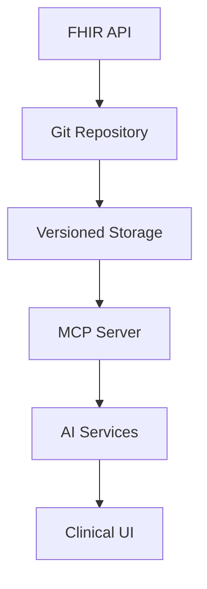

# MED.ia System Patterns

## Core Architecture
1. **Git-FHIR Bridge**:
   - FHIR resources stored as files
   - Commits represent changes
   - Branches for experimental edits

2. **MCP Integration**:
   - Context retrieval endpoints
   - Tool update endpoints
   - Audit logging

3. **AI Services**:
   - Vector embeddings of FHIR
   - RAG pipeline
   - Clinical validation layer

## Data Flow

## Security Patterns
1. **Attribute-Based Access**:
   - OPA policy evaluation
   - JWT claims processing
   - Break-glass protocols

2. **Audit Trail**:
   - Blockchain-backed logs
   - Immutable records
   - Tamper evidence

3. **Data Residency**:
   - Geo-fencing
   - Regional storage
   - Compliance adapters

## Integration Patterns
1. **Bulk Operations**:
   - Async processing
   - Job tracking
   - Resume capabilities

2. **Webhooks**:
   - Event notifications
   - Retry logic
   - Payload signing
